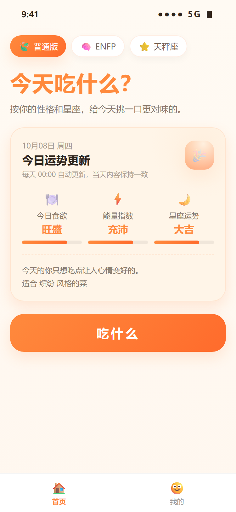
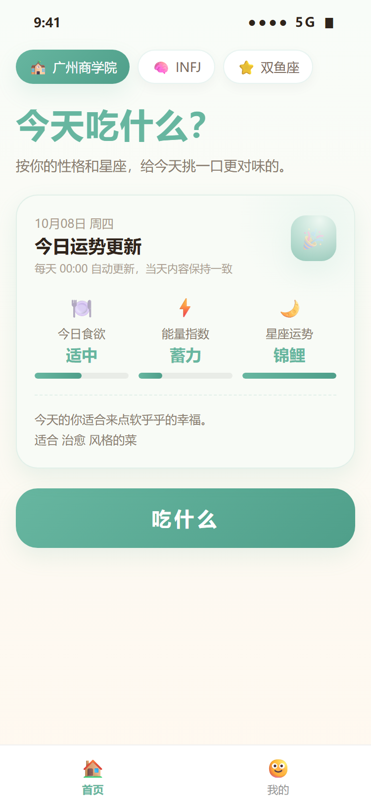
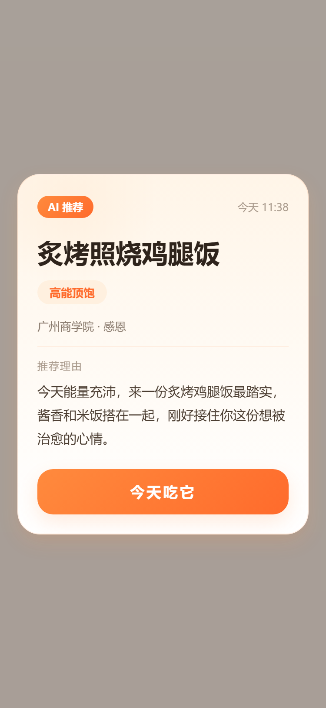
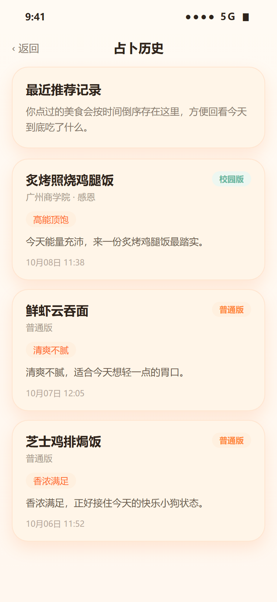
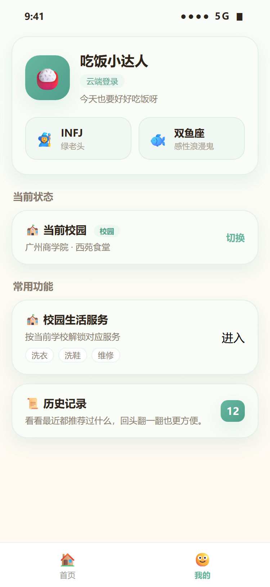
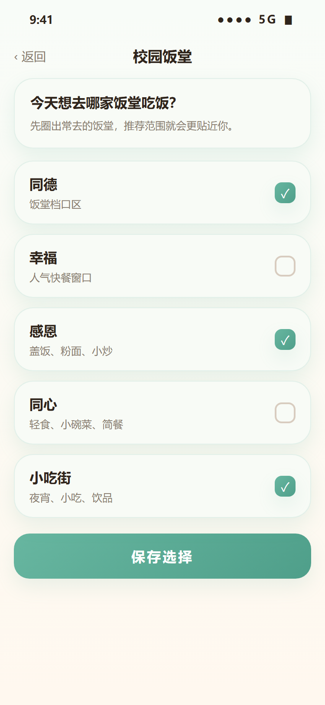

# 🍚 今天吃什么

> 按你的性格和星座，给今天挑一口更对味的。

一个基于 **uni-app + Vue 3** 的微信小程序。它把「今天吃什么」这个每天都在纠结的问题，变成一次轻松的小占卜：结合 **MBTI、星座和当日运势**，帮你挑出一份今天更顺口的推荐。

支持 **普通版（暖橙）** 与 **校园版（薄荷绿）** 双主题：普通版陪你解决日常选择困难，校园版则接入校园饭堂和校园生活服务，让推荐更贴近你的学校。

## 📱 界面预览

<p align="center">
  
  
  
  
</p>
<p align="center">
  
  
</p>

## ✨ 功能特性

- **每日运势**：每天 00:00 自动更新，生成今日食欲、能量指数和星座运势，当天内容保持一致。
- **智能推荐**：点一下「吃什么」，结合 MBTI + 星座 + 当前模式，随机筛出一份更对味的推荐。
- **AI 推荐理由**：先秒出模板文案，后台再异步调通义千问生成个性化理由并平滑替换，AI 失败也能无感降级。
- **灵活身份**：可选 MBTI（16 型）和星座（12 星座），每个人格和星座都有专属口味倾向与趣味别称。
- **历史记录**：用过的推荐按时间倒序保存，随时回看今天到底吃了什么。
- **双主题模式**：
  - **普通版**：暖橙色，轻松日常。
  - **校园版**：薄荷绿，接入校园饭堂与校园专属服务。
- **校园饭堂**：先圈出常去的饭堂，推荐范围就会更贴近你。
- **校园生活服务**：按当前学校解锁洗衣、洗鞋、维修等对应服务入口。
- **微信登录**：支持微信授权登录，云端同步用户资料。

## 🛠 技术栈

| 方向 | 选型 |
| --- | --- |
| 框架 | uni-app + Vue 3（`<script setup>`） |
| 平台 | 微信小程序 |
| 样式 | 原生 SCSS + 主题 token（`themeMap`） |
| 状态 | `ref` / `computed` + 共享工具层（无 Pinia / Vuex） |
| 云端 | uniCloud 阿里云服务空间 |
| 数据 | 本地优先、配置驱动、云端同步 + 本地降级 |
| AI | 通义千问 DashScope（`qwen-turbo`） |

## 📂 项目结构

```text
vue3+uniapp/
├─ App.vue                  # 全局入口与基础样式
├─ main.js
├─ pages.json               # 页面路由 + tabBar
├─ uni.scss                 # 共享基础样式与按压反馈
├─ pages/                   # 页面层：只负责 UI 与交互
│  ├─ index/                # 首页（今日运势 + 吃什么）
│  ├─ my/                   # 我的
│  ├─ history/              # 历史记录
│  ├─ campus/               # 校园选择 / 入驻申请
│  ├─ canteen/              # 校园饭堂选择与档口
│  ├─ service/              # 校园生活服务
│  └─ webview/              # 内嵌网页
├─ common/data.js           # 静态配置：主题色、MBTI / 星座、学校、饭堂、服务
├─ utils/
│  ├─ app-state.js          # 核心业务状态：本地存储 / 每日重置 / 推荐逻辑
│  ├─ user-state.js         # 用户登录态
│  ├─ cloud.js              # uniCloud 适配层（云对象调用 + 降级）
│  └─ privacy-state.js      # 隐私协议状态
├─ components/              # 可复用组件
├─ static/                  # 静态资源
├─ uni_modules/             # 第三方组件（pyh-nv / uni-icons / uni-scss）
└─ uniCloud-aliyun/         # 云对象 + 数据库 schema
```

架构上采用**页面驱动 + 配置驱动 + 工具层集中管理状态**：页面只负责展示与交互，静态业务配置集中在 `common/data.js`，本地业务状态与核心逻辑集中在 `utils/app-state.js`，云端调用统一走 `utils/cloud.js`。

## ☁️ 云端架构

```text
前端页面
  ↓
utils/cloud.js（适配层：云对象调用 + 降级策略）
  ↓
uniCloud 云对象
  ├── co-user      → 微信登录(openId) / 用户资料 / 状态同步 / 历史同步
  ├── co-campus    → 校园入驻申请 / 审核 / 已入驻校园列表
  ├── co-content   → 文本内容安全检查（微信 msgSecCheck）
  └── co-ai        → AI 推荐理由生成（通义千问）
  ↓
uniCloud 数据库              外部 AI 服务
```

**AI 推荐理由流程**：点击「吃什么」→ 立即显示模板理由（无感）→ 后台异步调用 `co-ai` 生成个性化文案 → 返回后平滑替换 → 失败则保持模板理由不变。

**降级策略**：
- 云端登录失败 → 自动降级为本地模拟登录
- 云端同步失败 → 仅本地存储，不阻塞用户操作
- 内容安全检查失败 → 暂时放行，不阻塞提交

## 🚀 本地运行

1. 用 [HBuilderX](https://www.dcloud.io/hbuilderx.html) 打开项目根目录。
2. 在 `manifest.json` 中确认已填写自己的微信小程序 AppID。
3. 运行 → 运行到小程序模拟器 → 微信开发者工具。
4. 如需云端能力，在 HBuilderX 中关联 uniCloud 服务空间，并上传 `uniCloud-aliyun/cloudfunctions/` 下的云函数。

> 未配置云端时，项目会自动走本地模式，核心玩法（运势、推荐、历史）均可正常体验。

## ⚙️ 上线前需要配置

1. **WX_APPSECRET**：`co-user/index.obj.js`、`co-content/index.obj.js`
2. **DASHSCOPE_API_KEY**：`co-ai/index.obj.js`（阿里云 DashScope 控制台获取）
3. **ADMIN_OPENIDS**：`co-campus/index.obj.js`（管理员 openid）
4. **开通内容安全能力**：微信公众平台 → 开发管理 → 接口设置 → 内容安全
5. **上传云函数**并初始化数据库集合

## 📄 相关文档

- [PROJECT_SPEC.md](./PROJECT_SPEC.md) — 项目结构与架构说明
- [AGENTS.md](./AGENTS.md) — 长期协作与开发规范

---

<p align="center">如果这个小程序帮你解决了「今天吃什么」，点个 ⭐ 就是最好的鼓励。</p>
